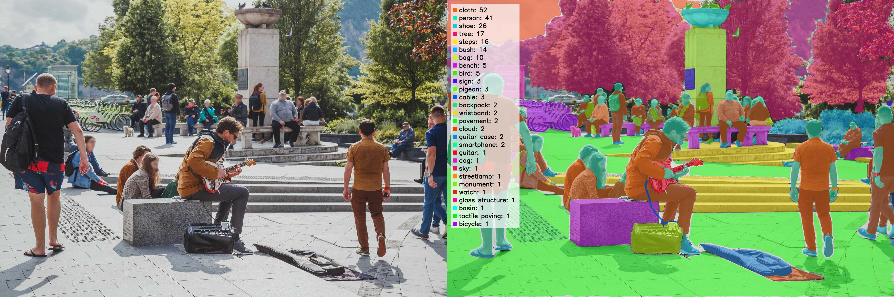
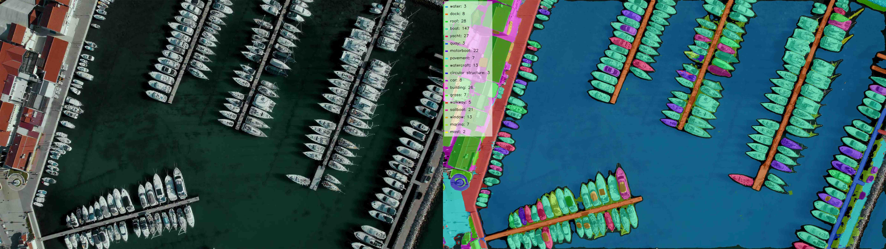
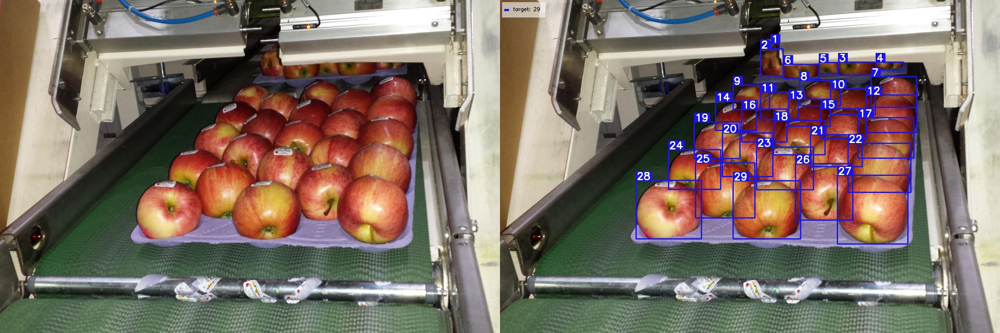
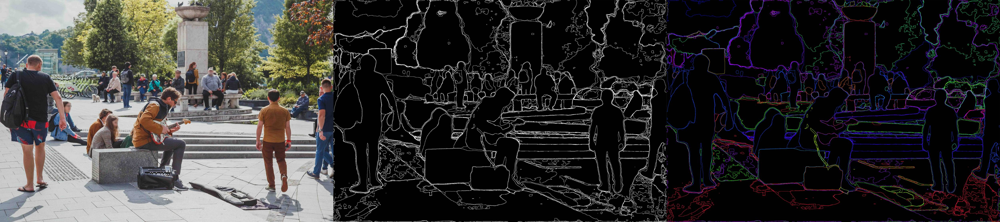
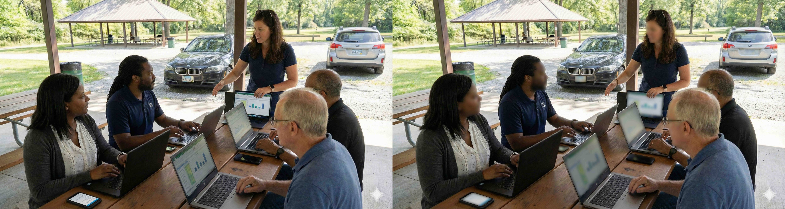

# SAM3 practical Workflows

[](https://github.com/facebookresearch/sam3)

***Pipelines powered by Segment-Anything-Model(SAM3) and Multimodal LLMs.***

This repository implements a suite of practical-grade vision tools designed for precise object counting, video retrieval, semantic edge detection, and privacy-preserving redaction. It bridges the gap between raw foundation models and practical, real-world applications by integrating **SAM3** with **OpenCLIP**, **BLIP**, and **GPT-5.2**.

**Segmentation/Object Counting(Anything):**


<table align="center" cellspacing="0" cellpadding="0" style="border-collapse: collapse; border: none; margin: 0; padding: 0;">
  <tr style="padding: 0; margin: 0; line-height: 0;">
    <td style="padding: 0; border: none; margin: 0;">
      
    </td>
    <td style="padding: 0; border: none; margin: 0;">
      
    </td>
  </tr>
  <tr style="padding: 0; margin: 0; line-height: 0;">
    <td style="padding: 0; border: none; margin: 0;">
      
    </td>
    <td style="padding: 0; border: none; margin: 0;">
      
    </td>
  </tr>
</table>

**Geometric(Prompt):**

**Semantic Edges(Anything):**

<table align="center" cellspacing="0" cellpadding="0" style="border-collapse: collapse; border: none;">
  <tr>
    <td style="padding: 0; border: none;">
      
    </td>
    <td style="padding: 0; border: none;">
      
    </td>
  </tr>
</table>

**Smart Privacy Reduction(Prompt):**

<table align="center" cellspacing="0" cellpadding="0" style="border-collapse: collapse; border: none;">
  <tr>
    <td style="padding: 0; border: none;">
      
    </td>
  </tr>
</table>

## 🚀 Key Features
**The core workflow**:

Mode1(```BLIP```): Image/Video Input → Captions(from ```25``` frame crops) by ```BLIP``` → Extract Clean Noun List by ```spaCy(Noun Parser)``` → Prompt ```SAM3``` → masks/bbox

Mode2(```LLM```): Image/Video Input → Captions(from ```25``` frame crops) by ```LLM``` → Extract Clean Noun List by ```LLM``` → Prompt ```SAM3``` → masks/bbox

### 1. Video Search Engine(RAG for Video)
* **Indexing:** Detect all objects on the scence by ```Mode2```, extract embeddings, next Indexing and store.
* **Natural Language Retrieval:** Search for specific moments in video using text(e.g., *"find the red sports car"*).
* **Visual Querying:** Find objects similar to a reference image.
* **Tech Stack:** Uses **OpenCLIP (ViT-g/14)** for embedding and **FAISS** for millisecond-scale vector search.

### 2. Smart Privacy Redaction
* **Automated Anonymization:** Automatically detects and blurs sensitive information like **Faces**, **License Plates**, **Credit Cards**, and **Screens**.
* **Temporal Consistency:** Uses SAM3's memory bank to track and redact moving targets without flickering.
* **Custom Targets:** Redact any arbitrary object by simply typing its name.

### 3. High-Precision Object Counting
* **Temporal Tracking:** Counts unique objects in image/video streams using trajectory analysis(filters out re-entries and noise).
* **Drift Correction:** Re-identifies objects across occlusions to prevent double-counting.
* **Dual-Mode Discovery:**
    * *Automatic:* Uses LLMs/BLIP to discover what objects are in the scene.
    * *Prompt-Based:* Counts specific user-defined targets (e.g., "count the helmets").

### 4. Semantic Edge & Segmentation
* **Instance Segmentation:** Pixel-perfect isolation of every object in the scene.
* **Morphological Edges:** Generates "neon-sketch" animations by mathematically extracting boundaries from semantic masks.


## Installation
* all examples are available in **```practical/ipynb```**.

### Prerequisites
* **GPU:** NVIDIA GPU with at least ```8GB``` VRAM for Image, and ```32GB``` for Video recommended.
* **OS:** Linux (Ubuntu 20.04+) or Windows WSL2.

### 1. Clone the Repository
```
git clone [https://github.com/MrKGhasemi/adadawd.git](https://github.com/MrKGhasemi/adadawd.git)
cd adadawd
```

2. Install Dependencies
This project relies on sam3(included as a submodule or local package) and standard vision libraries.

```bash
# Install core requirements
pip install -r requirements.txt

# Install the local SAM3 library (if not on PyPI)
pip install -e sam3/

# Download SpaCy language model for NLP parsing
python -m spacy download en_core_web_lg
```

3. Download Model Weights
Needs the ```SAM3 checkpoint```.

Option A (Automatic): The scripts will attempt to download from Hugging Face if ```HF_TOKEN``` is set.

Option B (Manual): Download ```sam3.pt``` from the [Meta_SAM3_Repo](https://huggingface.co/facebook/sam3) by grant request and place it in: ```weights/sam3.pt```

Quick Start & Usage
This repo provides modular scripts and Jupyter Notebooks for each task.

Video Privacy Redaction
Blur faces and license plates in a video.

```Python
import smart_reduction
from configs import MockArgs

# Setup
args = MockArgs(mode="blip", output_dir="outputs/")

# Run Redaction (Auto-detects faces, plates, etc.)
# Set prompt_text=None to use the default security list
output_info = smart_reduction.smart_reduction_video(
    "videos/crowd.mp4", 
    args, 
    prompt_text=None, 
    blur_strength=51
)
print(f"Redacted video saved to: {output_info['video_output_path']}")
```

Video Search Engine
Index a video and search for specific objects.

```Python
import video_search_engine

# 1. Build the Vector Index (Visual Memory)
# This processes the video and saves embeddings and index file to 'notebook_outputs/vector_db'
engine = video_search_engine.VideoSearchEngine()
engine.build_video_index("videos/traffic.mp4")
```

# 2. Search with Text
```Python
results = engine.search_video("red truck", top_k=3, save_video=True)
```

# 3. View Results
```Python
for res in results:
    print(f"Found '{res['query']}' at timestamp {res['timestamp']}s (Score: {res['score']})")
```
    
Object Counting (Video)
Count and track specific objects.

```Python
import object_counting

# Count 'person' instances
output_info = object_counting.count_objects_video(
    "videos/walikng.mp4", 
    args, 
    task_type="prompt", 
    prompt_value="person"
)
```

## 📂 Repository Structure
```Plaintext
adadawd/
├── practical/                  # Core Logic Modules
│   ├── config/                 # Sub-directory
│   │   └── configs.py          # Global configuration (Root level)
│   ├── images/                 # Image assets 
│   ├── videos/                 # Video assets 
│   ├── object_counting.py      # Tracking & Counting logic
│   ├── smart_reduction.py      # Privacy & Redaction logic
│   ├── video_search_engine.py  # Vector DB & Search logic
│   ├── semantic_edge.py        # Edge detection logic
│   ├── image_segmentation.py   # Static image segmentation
│   ├── class_generators.py     # BLIP/LLM integration
│   ├── visualization.py        # Drawing utilities (boxes, masks)
│   ├── models.py               # Model loading (SAM3, CLIP, etc.)
│   └── utils.py                # File I/O, compression, RLE encoding
├── sam3/                       # sam3 workflow codes
├── requirements.txt            # Python dependencies
└── LICENSE                     # Project License
```

## Configuration
Tuned the ```hyperparamters``` for system performance in ```configs.py``` with obsession for best results:
```
SAM3_CONF_IMAGE_THRESHOLD: (Default: 0.3) confidence score for detecting objects.

SAM3_CONF_IMAGE_FOR_COUNTING: (Default: 0.2) detect smaller/fainter objects.

SAM3_CONF_VIDEO_SEARCH_ENGINE_THRESHOLD: (Default: 0.2, also for smart reduction and cobject counting) Adjust for privacy sensitivity.

SAM3_IMAGE_SEGMENTATION_NMS_THRESHOLD: Non-Maximum-Suppression

LLM_CAPTION_MODEL_NAME: default is "gpt-5-chat", for generating captions for each crop image if using API mode.

LLM_PARSER_MODEL_NAME = default is "gpt-5.2-chat", for extracting nouns as prompts to SAM3.
```

## Acknowledgements
[SAM3(Segment Anything Model)](https://github.com/facebookresearch/sam3): The main model of the workflow. Uses the SAM3 License(from Meta). See sam3/LICENSE for details regarding model weights and usage.

[BLIP](https://github.com/salesforce/BLIP): Captioning model.

[OpenCLIP](https://github.com/mlfoundations/open_clip): Used in the search engine.

[FAISS](https://github.com/facebookresearch/faiss): For the vector similarity search in the search engine.
